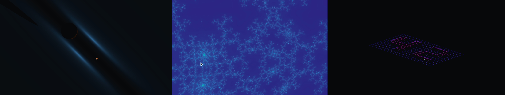

<h1 align="center">Welcome to my portfolio</h1>

</img>

  <a href="https://github.com/PietarTheWise/rtv1">RTv1</a> •
  <a href="https://github.com/PietarTheWise/fractol">Fractol</a> •
  <a href="https://github.com/PietarTheWise/fdf">Fdf</a>

## Hi, I'm Pietari Noutere

  I'm a developer with a strong design background, interested in various fields in the coding sector. Currently working a lot with computer graphics, and taking more and more interest in neural networks. In my past I've done plenty of graphics and ui design, also worked with solidity and deployed a decentralized application. I've also worked on a few startups gaining experience from robotics, iot and frontend development.

## Skills:

C / C++ / Python / Html / Css / Javascript / Solidity / Golang / React / Aws
