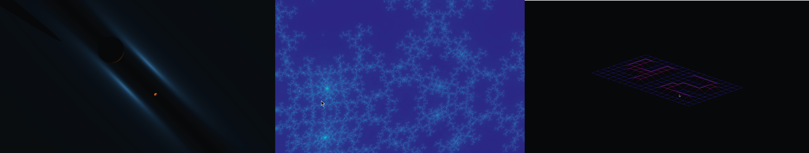

<h1 align="center">One Portfolio To Rule Them All</h1>

## Pietari Noutere

Software developer focused on C/C++ and systems-level programming. Experience includes embedded robotics development, hardware-software integration and performance-critical 3D simulation systems. Strong background in debugging, algorithms and building reliable technical software.

### My Latest Work Includes:
<a href="https://github.com/PietarTheWise/can-device-sim">Can Device Simulator</a> An Embedded-style C++ controller and device simulation over a CAN-inspired bus, with state machine, heartbeat watchdogs, and coordinated safety shutdown.
 
 
<a href="https://github.com/PietarTheWise/mock-spacecraft-avionics">Mock Spacecraft Avionics Project</a> FreeRTOS-based mock spacecraft avionics on STM32 F411RE. Multi-task sensor fusion with communication from ground station (laptop) to the device (Nucleo Board).
 
 
<a href="https://github.com/PietarTheWise/image-masker">Image Masker</a> Trained a U-Net neural network on the COCO dataset to perform image segmentation, extracting target objects from images. Built and iterated in Jupyter Notebook, covering the full workflow from data preparation to model training.

https://github.com/user-attachments/assets/65297ff9-a04a-4c41-bd68-444dafec846a

 
 

## Pre AI C Projects
</img>

  <a href="https://github.com/PietarTheWise/rtv1">RTv1</a> •
  <a href="https://github.com/PietarTheWise/fractol">Fractol</a> •
  <a href="https://github.com/PietarTheWise/fdf">Fdf</a>

## Technical Skills

### Programming Languages
- C
- C++
- Python
- TypeScript

### Systems & Backend
- Data pipeline development (ETL, web scraping, automation)
- REST API design
- Data processing and validation
- Application architecture

### Graphics & Visualization
- Three.js
- WebGL
- 3D application development
- Performance optimization for browser-based rendering

### Mobile Development
- React Native
- Cross-platform application architecture

### Cloud & Tooling
- Google Cloud
- AWS
- Docker
- Git
- CI/CD workflows
